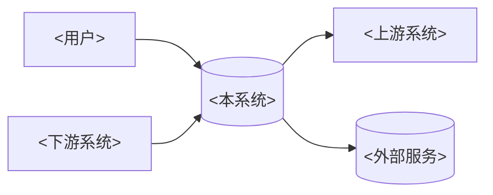
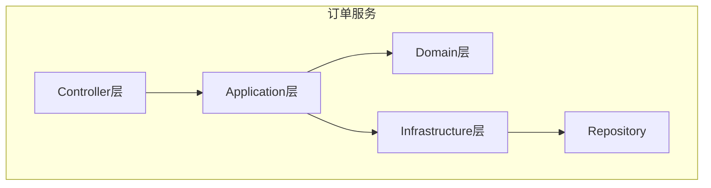
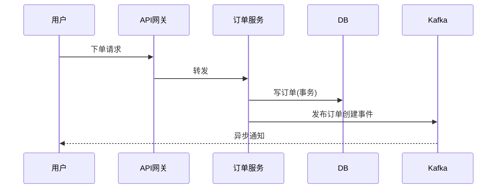
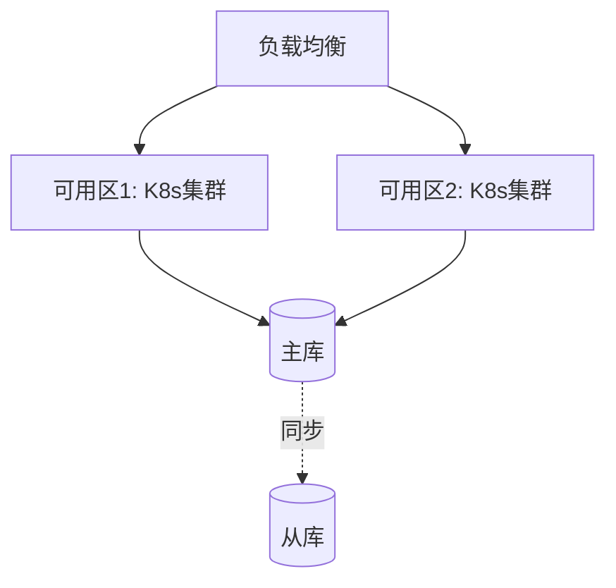

# 架构设计文档模板

本模板是阶段3产出的文档骨架。**严格按此结构组织**，每章按"结论先行 -> 展开细节"的写法。占位符 `<>` 表示需要你填充；`[注释]` 是写法指引，产出时删除。

文档文件名：`架构设计文档-<系统名>.md`

---

````markdown
# <系统名> 架构设计文档

> 版本：<v1.0> · 日期：<YYYY-MM-DD> · 作者：<author> · 状态：<草案/评审中/已定稿>

## 文档元信息

| 项 | 内容 |
|----|------|
| 系统名 | <系统名> |
| 文档版本 | <v1.0> |
| 关联需求/PRD | <链接或编号> |
| 评审状态 | <草案/评审中/已定稿> |
| 主要干系人 | <产品/研发/运维/安全/业务方> |

---

## 1. 概述与目标

[结论先行：1-2 句说明本系统是什么、解决什么核心问题。然后展开。]

### 1.1 系统定位
<一句话定位：本系统是 <领域> 的 <角色>，为 <用户/系统> 提供 <能力>。>

### 1.2 设计目标
<3-5 条核心目标，每条对应一个可验证结果。例：>
- 支撑峰值 5 万 QPS 的订单写入，P99 < 200ms
- 支持 99.95% 可用性（年停机 < 4.4h）
- 新功能交付周期从 2 周缩短至 3 天

### 1.3 非目标（Out of Scope）
<明确不做什么，避免范围蔓延。例：本阶段不做多租户、不实现实时推荐。>

### 1.4 术语
<本文关键术语简表，详见附录完整术语表。>

---

## 2. 业务背景与范围

### 2.1 业务背景
<为什么现在做这个系统？业务痛点/机会/合规驱动。不要堆砌业务介绍，聚焦"架构决策的因"。>

### 2.2 核心业务场景
<列出 3-7 个核心场景，每个含：触发方、主流程、关键约束。这是后续推理的锚点。>
| 场景 | 触发方 | 主流程摘要 | 关键约束 |
|------|--------|-----------|---------|
| <用户下单> | <C端用户> | <选品->下单->支付->履约> | <支付强一致、峰值高并发> |

### 2.3 系统边界与范围
<明确系统管什么、不管什么。与上下游的职责切分。>
- **系统内**：<本系统负责的能力>
- **系统外（依赖）**：<外部系统及职责归属>
- **系统外（被依赖）**：<谁依赖本系统>

### 2.4 干系人与关注点
<不同干系人对本系统的关注点，影响视图与决策优先级。>
| 干系人 | 关注点 |
|--------|--------|
| 业务方 | <功能完备、上线节奏> |
| 运维 | <可观测、可回滚、容量> |
| 安全 | <合规、数据保护> |

---

## 3. 需求与质量属性（NFR）

[这是架构形态的真正驱动力。每条必须可验证。]

### 3.1 功能性需求摘要
<不重复 PRD，只列影响架构的功能性需求。如：需要支持分布式事务、需要事件回放、需要多端实时推送。>

### 3.2 质量属性（驱动架构）
<按质量属性逐条列出，每条：场景化描述 + 量化指标 + 优先级。优先级标注"驱动(D)"或"重要(I)"或"约束(C)"。>

| 质量属性 | 场景 | 目标指标 | 优先级 |
|---------|------|---------|--------|
| 性能 | <下单峰值> | <5万 QPS, P99<200ms> | D |
| 可用性 | <订单服务> | <99.95%> | D |
| 可扩展性 | <数据增长> | <年增 50TB，水平扩容> | I |
| 一致性 | <库存扣减> | <强一致，不超卖> | D |
| 可维护性 | <新功能> | <3天交付> | I |
| 安全合规 | <用户数据> | <等保三级/GDPR> | C |

[读取 references/quality-attributes.md 确保覆盖完整 NFR 维度。]

### 3.3 容量与规模假设
<用户数、数据量、QPS、带宽等的当前值与增长预测。标注假设来源。>
| 维度 | 当前 | 1年预测 | 3年预测 | 来源 |
|------|------|---------|---------|------|
| 注册用户 | <100万> | <500万> | <2000万> | <业务方/假设> |
| 日均订单 | <50万> | <200万> | <800万> | <业务方> |

---

## 4. 架构约束

<约束是"不能改的前提"，区别于"可以选择的决策"。显式列出约束能避免在不可选项上浪费决策。>

### 4.1 技术约束
<既有技术栈、必须复用的系统、协议约束等。>
- <必须部署在私有云 K8s>
- <消息中间件统一用公司 Kafka 集群>
- <存储统一用 PostgreSQL + Redis>

### 4.2 组织约束
<团队规模、技能栈、组织结构（Conway 定律：系统架构会镜像组织沟通结构）。>
- <后端团队 8 人，Java 栈>
- <无专职 SRE，需低运维方案>

### 4.3 业务/合规约束
<合规、数据主权、审计、保留期等硬约束。>
- <金融交易需可审计追溯，日志保留 5 年>
- <用户数据不出境>

### 4.4 时间/成本约束
<上线节点、预算上限。>
- <MVP 须 3 个月内上线>
- <年基础设施成本 < X 万元>

---

## 5. 架构视图（C4）

[用 Context -> Container -> Component 三层视图，每层用 Mermaid 图 + 文字说明。图与文必须一致。]

### 5.1 上下文视图（Context）
<系统边界与外部依赖。给业务方看。回答"系统与谁交互"。>



<文字说明：每个外部交互方、交互方式（同步/异步）、数据/协议、频率。>

### 5.2 容器视图（Container）
<技术栈与部署单元。给架构/运维看。回答"由哪些可独立部署的组件构成、用什么技术、如何通信"。>

```mermaid
graph TB
    subgraph <本系统>
        Web[<Web前端><br/>React] --> API[<API网关><br/>Go]
        API --> Svc[<订单服务><br/>Java/SpringBoot]
        Svc --> DB[(<PostgreSQL>)]
        Svc --> MQ[<Kafka>]
        MQ --> Worker[<履约Worker><br/>Python]
    end
```

<逐个容器说明：职责、技术栈、通信方式与协议、关键配置。>

### 5.3 组件视图（Component）
<核心服务内部模块划分。给开发看。回答"这个服务内部怎么分层分模块"。对最复杂的 1-2 个容器展开即可，不必每个都画。>



<模块职责与依赖关系说明。>

### 5.4 关键数据流
<1-3 条端到端关键流程，用时序图说明跨容器协作。>



---

## 6. 关键架构决策（ADR + 权衡）

[本章是文档的可信度核心。每个关键决策一条 ADR。读取 references/adr-format.md。]

### ADR-001：<决策标题，如"订单状态采用事件溯源">

- **状态**：<已接受/提议/已废弃>
- **背景**：<为什么需要这个决策？对应的场景与约束。>
- **决策**：<选了什么。>
- **备选方案**：
  | 方案 | 优势 | 劣势 |
  |------|------|------|
  | <方案A: 事件溯源> | <审计追溯、可回放、解耦> | <复杂度高、最终一致> |
  | <方案B: CRUD状态表> | <简单、强一致> | <无历史、难审计> |
  | <方案C: 状态机+变更日志> | <折中> | <仍需自管日志> |
- **决策标准**：<按哪些质量属性评判。如一致性 vs 审计性 vs 复杂度。>
- **结论与权衡**：<选 A。代价：引入最终一致性与运维复杂度，用 X/Y 缓解。换取：完整审计与事件回放，满足合规驱动属性。>
- **影响**：<引入的复杂度、需配套的设施、对团队技能要求。>

### ADR-002：<下一个关键决策>
<...同上。典型需 ADR 的决策：通信模式(同步/异步)、数据一致性策略(2PC/Saga/最终一致)、存储选型、缓存策略、分库分表、服务拆分边界、幂等与去重、限流降级方案等。>

---

## 7. 部署与运维

### 7.1 部署拓扑
<部署视图：环境、集群、区域/可用区、流量入口。>



### 7.2 发布与变更
<发布策略：蓝绿/灰度/滚动；回滚机制；配置变更流程。>

### 7.3 容量与资源规划
<基于 3.3 的规模假设，给出资源规格与扩容阈值。>
| 组件 | 规格 | 副本数 | 扩容阈值 |
|------|------|--------|---------|
| 订单服务 | 4C8G | 6 | CPU>70% |

### 7.4 运维职责与 Runbook 指引
<日常运维、值班、故障响应流程的指引或链接。>

---

## 8. 安全与合规

### 8.1 认证与授权
<身份认证、RBAC/ABAC、API 鉴权方式。>

### 8.2 数据安全
<传输加密、存储加密、脱敏、密钥管理。>

### 8.3 合规
<适用的法规（GDPR/等保/PCI-DSS/金融监管）、数据保留、审计日志要求。>

### 8.4 安全边界与威胁面
<主要威胁模型摘要：入口、信任边界、敏感数据流。>

---

## 9. 可观测性与容灾

### 9.1 可观测性三支柱
- **指标(Metrics)**：<关键业务/系统指标、采集方式、告警阈值。>
- **日志(Logs)**：<结构化日志规范、采样、保留。>
- **链路(Traces)**：<分布式追踪接入、采样率。>

### 9.2 告警与 SLO
<SLO 定义、错误预算、告警分级与通知。>
| SLO | 目标 | 错误预算 | 告警阈值 |
|-----|------|---------|---------|
| 订单API可用性 | 99.95% | 22m/月 | <99.9% 告警 |

### 9.3 容灾与高可用
<多活/主备策略、故障切换 RTO/RPO、数据备份与恢复。>
| 场景 | RTO | RPO | 策略 |
|------|-----|-----|------|
| 单节点故障 | <30s> | 0 | K8s自动调度 |
| 可用区故障 | <5min> | <1min> | 跨AZ主从切换 |

### 9.4 限流降级与混沌
<限流策略、降级方案、熔断、混沌演练计划。>

---

## 10. 演进路径与风险

### 10.1 演进路径
<从当前到目标架构的阶段化路线。避免一次性大重构。>
| 阶段 | 目标 | 关键交付 | 预计周期 |
|------|------|---------|---------|
| MVP | <核心闭环> | <单服务可用> | <3月> |
| V2 | <水平扩展> | <分库分表> | <6月> |

### 10.2 已知风险与缓解
<汇总前文假设、待确认项、技术债、容量风险，每条含缓解措施。>
| 风险 | 影响 | 概率 | 缓解措施 |
|------|------|------|---------|
| <峰值QPS假设偏低> | <容量不足> | 中 | <压测验证、预留扩容> |
| <事件溯源学习曲线> | <交付延迟> | 中 | <培训+结对+PoC> |

### 10.3 假设与待确认项汇总
<把全文"假设值/待确认"集中于此，便于追踪闭环。>
| 编号 | 假设/待确认 | 影响章节 | 负责人 | 状态 |
|------|-----------|---------|--------|------|
| A1 | <峰值5万QPS> | 3.2/7.3 | <业务方> | 待确认 |

### 10.4 技术债务
<有意接受的债务及其偿还计划。>

---

## 附录

### A. 术语表
| 术语 | 含义 |
|------|------|
| <CQRS> | <Command Query Responsibility Segregation，命令查询职责分离> |

### B. ADR 索引
| 编号 | 标题 | 状态 |
|------|------|------|
| ADR-001 | <事件溯源> | <已接受> |

### C. 参考与依据
<引用的官方文档、规范、内部文档链接。体现"有据可依"。>
- <https://...> 官方文档
- <内部 PRD/Wiki 链接>

### D. 修订记录
| 版本 | 日期 | 变更 | 作者 |
|------|------|------|------|
| v1.0 | <date> | <初稿> | <author> |
````

---

## 写作检查清单（交付前自检）

产出后对照 SKILL.md 阶段4自检清单逐条核验。重点：每条 NFR 可验证、每个决策有 ADR、C4 三层齐全且图文一致、无编造指标、跨切面覆盖、假设已汇总。
